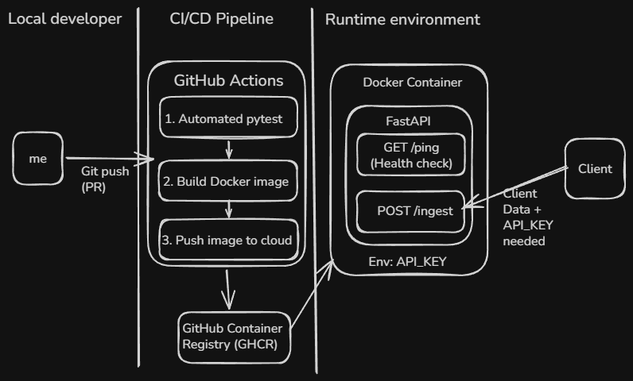

# Containerized Data Ingestion API 

## 📖 Overview
This project simulates an enterprise-level production environment for self-learning. It shows the process of building a secure, containerized application scaffold. This project includes a complete CI/CD pipeline using Github Actions for automated testing (via pytest) and deployment. It makes sure only uploading the final Docker image to GitHub Container Registry (GHCR) only after all tests are successful. In addition, it prevents direct `main` pushes and requires a Pull Request process to ensure branch governance.

## 🌉 Architecture

  

The deployment flow uses GitHub Actions for continuous integration, ensuring all automated tests pass before a Docker image is pushed to the GitHub Container Registry (GHCR). In the runtime environment, the containerized FastAPI needs an `API_KEY` for authorization to receive incoming data.

## ⚡ Quick Start
* **Option 1:** Run via cloud image (Fastest)  
1. Pull the cloud Docker image
```bash
docker pull ghcr.io/chungchehsiao-tech/python-fastapi-data-ingestion-simulation:latest
``` 
2. Run the container
```bash
docker run -p 8000:8000 -e API_KEY="your_key" ghcr.io/chungchehsiao-tech/python-fastapi-data-ingestion-simulation:latest
``` 
* **Option 2:** Local run   
1. Clone the repo
```bash
git clone https://github.com/chungchehsiao-tech/python-fastapi-data-ingestion-simulation
```
2. Build the Docker Image
```bash
docker build -t test-api:v1 .
```
3. Run the container
```bash
docker run -p 8000:8000 -e API_KEY="your_key" test-api:v1
``` 

## 🚪 API endpoints
### 1. Health Check
Check if our API is running
* **URL:** `/ping`
* **Method:** GET
* **Auth Required:** None
* **Success Response:** `200 OK`, `status: active` ,`message: API is running securely!`
### 2. Data Ingestion
Receives and validate client's data
* **URL:** `/ingest`
* **Method:** POST
* **Auth Required:** Yes, must pass an API_KEY in the Header  
* **Headers:** `"authorization"="your_key"`
* **Data:**  `"user_id"= id`,  `"data_payload": "your message"`
* **Success Response:** `200 OK`

#### ⚠️ **Testing notes:** 
Using FastAPI Swagger UI in FastAPI (`/docs`) may fail during POST function test. Please execute a virtual request directly.

For Windows (Command Prompt):
```cmd
curl -X POST http://127.0.0.1:8000/ingest -H "authorization: test123" -H "Content-Type: application/json" -d "{\"user_id\": 1, \"data_payload\": \"test\"}" 
```

For Windows (PowerShell):
```powershell
Invoke-RestMethod -Uri "http://127.0.0.1:8000/ingest" -Method Post -Headers @{"authorization"="your_key"; "Content-Type"="application/json"} -Body '{"user_id": 1, "data_payload": "Terminal test."}'
```  
🖼️ Expected terminal image on Powershell Client:


For Mac / Linux:
```bash
curl -X POST http://127.0.0.1:8000/ingest -H "authorization: your_key" -H "Content-Type: application/json" -d '{"user_id": 1, "data_payload": "Terminal test."}'
```

Note: This project was developed and locally verified on a Windows environment using Docker Desktop. Standard POSIX commands are provided for Mac/Linux compatibility.


## 🧰 CI/CD Pipeline & Governance
* **Testing:** `pytest` runs automatically on every push  
* **Deployment:** Builds Docker Image and pushes to GHCR after all tests successful
* **Governance:** The `main` branch is strictly locked. No direct Push. Need Pull Request (PR) and passing status check before merging  


![\[CI pipeline link\] ](https://github.com/chungchehsiao-tech/python-fastapi-data-ingestion-simulation/actions/workflows/ci.yml/badge.svg)   


## 💡 Engineering Retrospective
* **Pair programming using AI:** Used an LLM as a Senior Engineer to guide me through the process of building an enterprise-level project. This accelerated my understanding of Dockerfile writing, YAML syntax for CI/CD pipeline (ci.yml), and Pull Request governance during a production development.  
* **Troubleshooting:** Encouter some real-world debugging secnarios. First, Swagger UI in FastAPI may fail on POST request due to browser security policy and need a virtual terminal request. Second, JSON request needs to be formatted differently in CMD and Powershell . Last, a single typo in a YAML file may stop the entire GitHub Action workflows from finding correct repository in the cloud.


